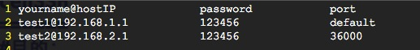

cenSSH
======
#目的：
因为习惯使用mac工作(linux也适用)，而mac下又没有很方便的ssh客户端（目前我还没有找到自己心仪的），每次输入密码都让我觉得难受，因此写了这个脚本来简化工作

#功能：
能够添加主机，会帮你记住密码，之后每次输入命令`cenSSH`（要将cenSSH加入环境变量），都会列出所有的主机名，只要按主机名前面的序号就能直接连上了

#项目组成：
- shell脚本 cenSSH
- 配置文件 host_list

#使用方法：
1. 下载两个文件（cenSSH和host_list），放到自己喜欢的目录中，两个文件必须放在一起
2. 将该目录放到环境变量中（mac用户可以在~/.bash_profile中添加，linux可以在~/.bashrc中添加）
	
		export PATH=$PATH:脚本所在目录
		例如 export PATH=$PATH:~/code/
3. 可以在配置文件host_list中直接加入你的开发机，也可以通过命令`cenSSH -a`或者`cenSSH add`进行
4. ssh主机：
		
		$ cenSSH
		命令会给你列出一系列主机的IP，你只要输入IP前面的数字就能连上相应主机
		
		$ cenSSH 数字
		如果你记住了IP对应的数字，也可以直接这样连

#其他
- 配置文件  
  
port那一列输入default表示默认端口，否则输入具体端口号
